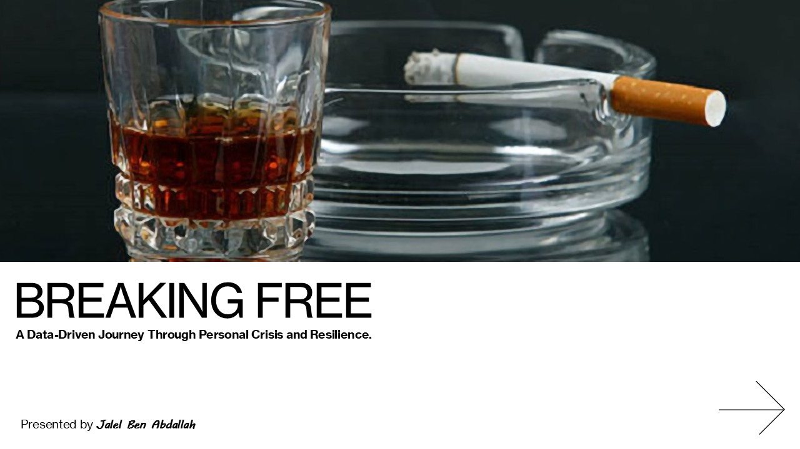
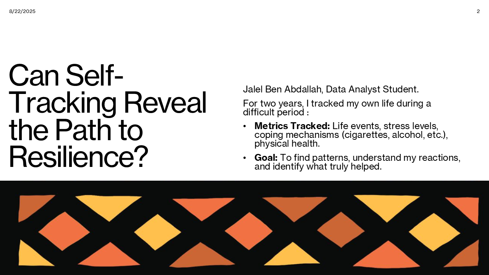
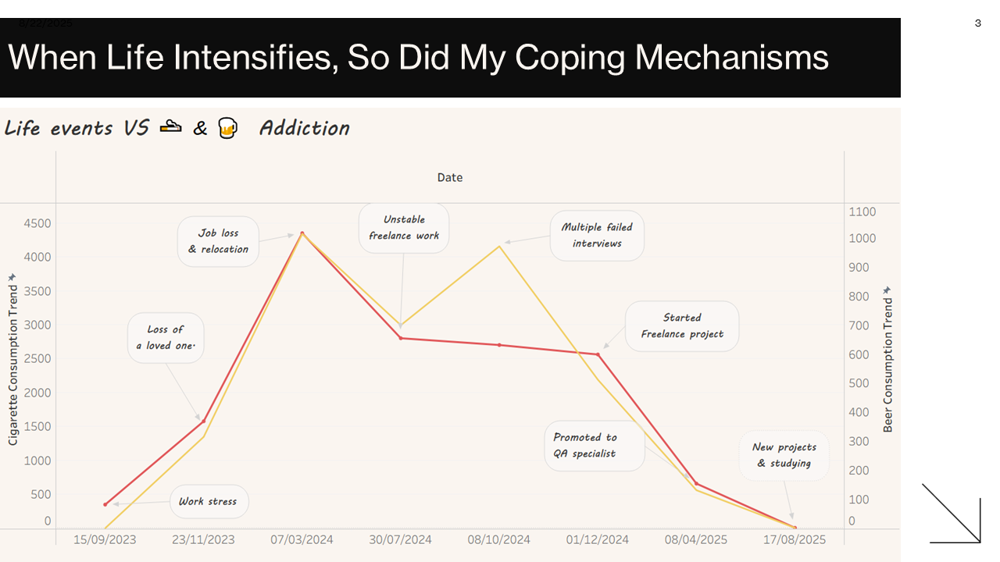
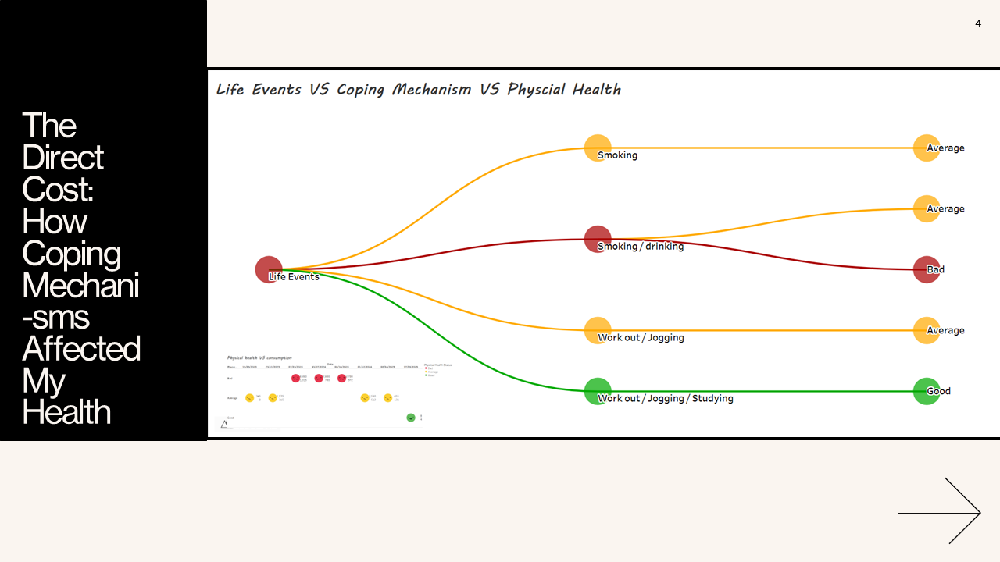
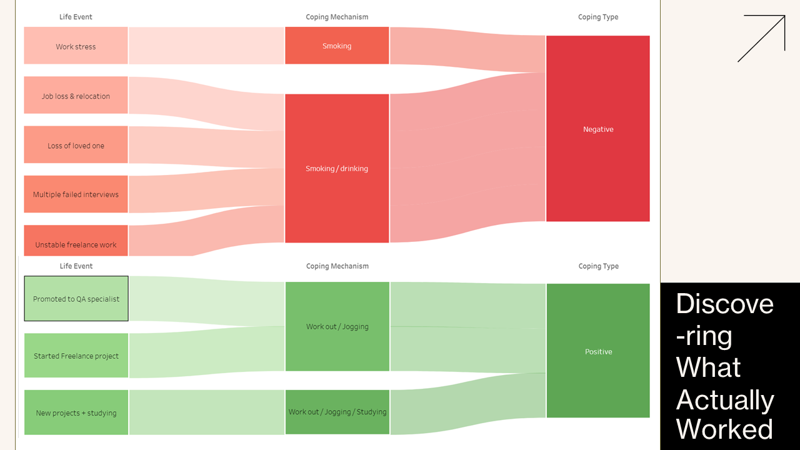
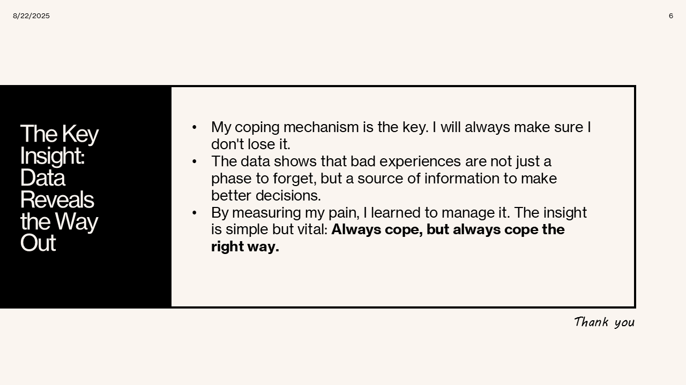
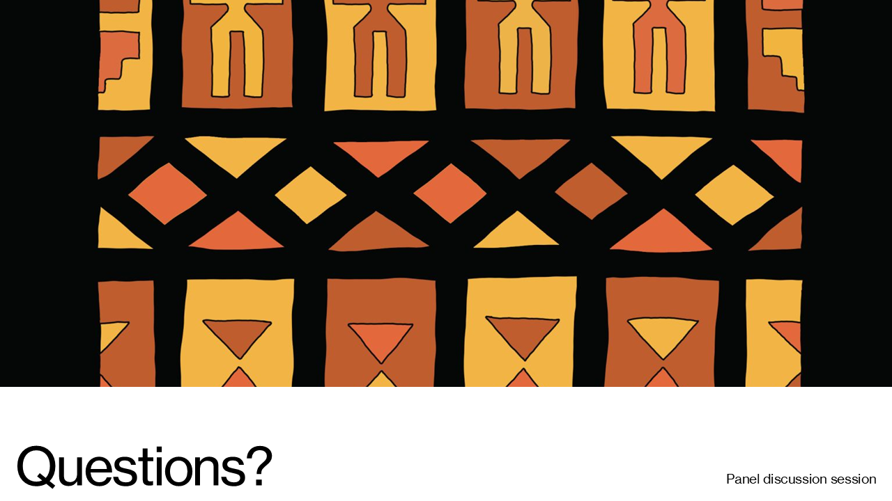

# Breaking Free  
**A Data-Driven Journey Through Personal Crisis and Resilience**  
*By Jalel Ben Abdallah*  

This project is my Google Data Analytics Capstone, a personal, data-driven story about understanding and overcoming addiction and stress using self-tracking.

---

## 📊 Introduction

Can self-tracking reveal the path to resilience?

Over two years, I tracked:
- Life events and major stressors
- Coping mechanisms (cigarettes, alcohol, etc.)
- Physical health and stress levels

My goal: to find patterns, understand my reactions, and identify what truly helped.

---

## 🖼️ Full Presentation

### Slide 1  

---

### Slide 2  
**Can Self-Tracking Reveal the Path to Resilience?**  
*Jalel Ben Abdallah, Data Analyst Student*  
> For two years, I tracked my life during a difficult period:
> - Life events
> - Stress levels
> - Coping mechanisms (cigarettes, alcohol, etc.)
> - Physical health

> Goal: Find patterns, understand my reactions, and identify what truly helped.

---

### Slide 3  
**When Life Intensifies, So Did My Coping Mechanisms**  

---

### Slide 4  
**The Direct Cost: How Coping Mechanisms Affected My Health**  

---

### Slide 5  
**Discovering What Actually Worked**  

---

### Slide 6  
**The Key Insight: Data Reveals the Way Out**  
> - My coping mechanism is the key. I will always make sure I don't lose it.  
> - Bad experiences are not just a phase to forget, they are a source of insight.  
> - By measuring my pain, I learned to manage it.

> 💡 Always cope, but always cope the right way.

---

### Slide 7  
**Thank You 🙏**  
*Panel discussion & Questions*  

---

## 📅 Presented on: August 22, 2025  
🎓 Part of the Google Data Analytics Capstone

---

